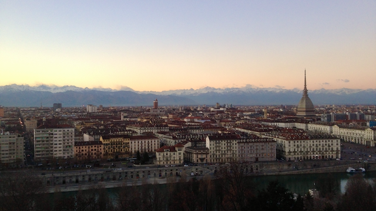
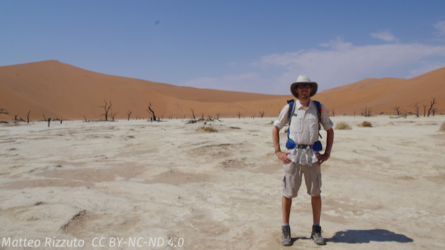
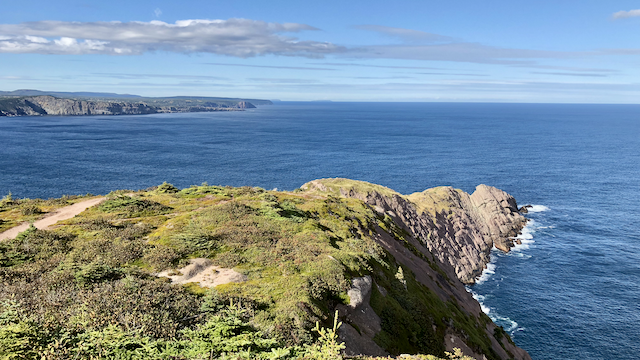
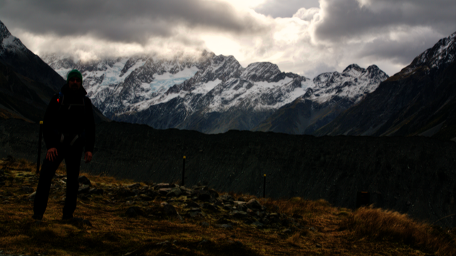

My academic accomplishments are listed in my [cv](https://matteorizzuto.github.io/cv/).

# Early years
I was born and raised in Turin, Italy. Nestled among the Western Alps, Turin was Italy's first capital city and has a strong connection with its astonishing natural environment. Its strategy location means you are always no more than a couple of hours away from the nearest mountains --- something that hugely influenced my childhood and teenage years. My family would take long summer vacations at out mountain cabin, where I would spend days trumping around the yard, observing ant nests, and hiking. Combined with my love for the works of J.R.R. Tolkien, these early experiences influenced me so much that by the time I reached 12 I knew I wanted to be a biologist. After graduating high school, where I briefly considered a linguistic career, I got my BSc in Biology from the [University of Turin](www.unito.it/en).

# Graduate Work
During the final year of my Biology BSc, I developed an interest in animal behaviour, so I enrolled in a Master of Science degree in Evolution of Human and Animal Behaviour at the University of Turin. During the MSc's two years, I became interested in mathematical theory applied to ecology and to predator-prey interactions. I worked with Francesca Marucco for my MSc thesis on predator-prey interactions in the Western Alps, and Francesca's approach to fieldwork heavily influenced mine. After graduating my MSc, I decided to develop my quantitative skills further and enrolled in a Master of Research at Imperial College London. Here I worked with Samraat Pawar and Chris Carbone to study the allometry of activity budgets in mammals. I owe much of the scientist I am today to Samraat's analytical approach and Chris's macro-ecological vision.

After graduating my MRes with a Distinction, I moved to St. John's, Newfoundland to work with [Shawn Leroux](http://shawnleroux.wixsite.com/lerouxlab) for my Ph.D. Working with Shawn, and the [Terrestrial Ecology Research Group](https://terrestrialecologyresearchgroup.weebly.com), has helped me weave together my interest for animal behaviour, theoretical ecology, and ecosystem ecology. Between tramping around the boreal forests of Newfoundland and working in the lab, I became interested in how animal move nutrients around, so I decided to study how consumers factor in nutrient exchange pathways among ecosystem and what this means for the nutrient budget of an ecosystem.

# Other then Science
I am a traveler, hiker, and photographer. I enjoy visiting new places and meeting new cultures. Books have always been an important part of my life: a recent count at my parents' house revealed I grew up amidst more than 3400 books. So, more often than not, you will find a book in my hand or in my backpack.

