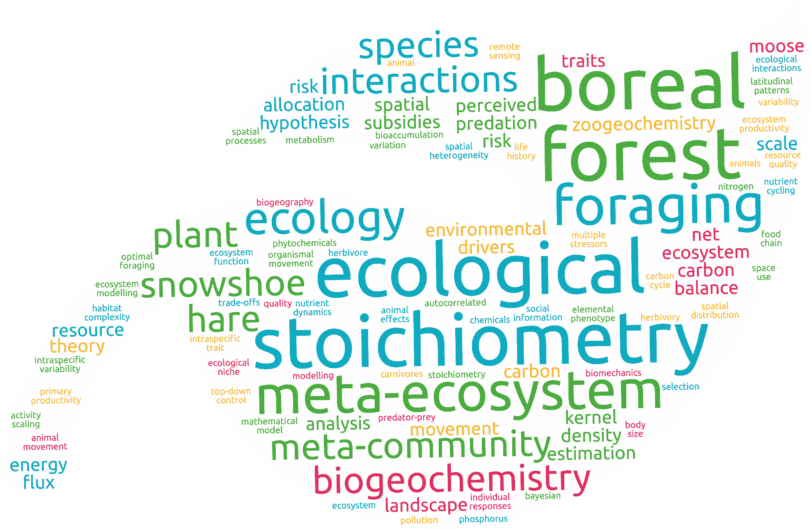

# Hi, I'm Matteo and I am an ecologist.
 
## I study how organisms interact with their environment to shape the world around them. Welcome to my website!

My research focuses on how energy, matter, and information shape the relationships between living beings and their environment. Using a mix of empirical and theoretical approaches, I work to expand models of ecosystem functioning. I do this by measuring exchanges of matter, energy, and information between organisms and their environment, and by developing new theoretical models to predict how these exchanges shape ecosystems. Through my research, I aim to expand our knowledge of how ecosystems work, ultimately improving how we predict and mitigate the impact of human activities on our planet.

<figure>

<figcaption>A word cloud produced from keywords in my published papers</figcaption>
</figure>
