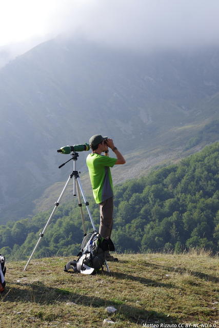

## 2015: Tsaobis Baboon Project

In summer 2015, I spent three months in the Tsaobis Nature Park, on the fringes of the Namibian Desert, collecting data on Chacma Baboon (_Papio ursinus_) behavior and population ecology. Work schedule involved daily hiking in the Tsaobis riverbed and surrounding hills following one of two habituated baboon troops. Researchers worked in pairs to perform individual focal sampling, scan surveys of activity and ad libitum collection of social interactions. Each of us spent a whole month learning how to correctly identify each of the 90+ adult baboons that made up the two troops. Once a month, we conducted vegetation surveys to assess food availability and feces collection to analyze parasite loads.

The Tsaobis Baboon Project is a long-term study conducted by the Zoological Society of London. You can learn more about it on their [website](https://www.zsl.org/science/research/baboon).

## 2014: Comparison of two commonly used methods to estimate species diversity: dung counts and camera trapping

In summer 2014, as part of my Master of Research degree at Imperial College London, I designed and performed a study comparing different techniques used in assessing species community composition. I collected my data in the Hluhluwe-iMfolozi Park (South Africa), as part of an existing experimental program investigating herbivores response to predation risk and resource availability manipulation. I used a fully-factorial experimental setup, comprised of four sampling plots paired together by type of treatment and habitat composition.  I visited each plot on a bi-weekly schedule, counting feces with the help of a local guide and collecting photos from camera traps at the same time. Working at close contact with locals, I developed strong bonds with them and learned a lot about both Zulu and South African culture. I also helped some of the fellow researchers present in the park around the same time as me, engaging in plant phenology surveys and lion collaring.

## 2014: The Scaling of Activity Budgets in Carnivores.

My first research project for my Master of Research degree involved a computer-based meta-analysis of the literature on activity patterns of carnivores. Working at Imperial College Silwood Park Campus, I investigated whether the amount of time carnivores spend active during a 24-hour period scales with body weight. I assembled a novel, comprehensive database of activity data for species spanning in size from the Least Weasel (_Mustela nivalis_) to Tigers (_Panthera tigris_), digitizing tables and graphs from published sources. My analyses focused strictly on radio-tracking data, as these are the best-quality data on animal activity available at present. In addition to analyzing these empirical data, I also developed a simple mathematical model - based on physiological first principles - that will allow researchers and wildlife managers to predict how much time a given species spends active during the day. This, in turn, will hopefully inform both future studies design and conservation policy.

## 2013: Roe and Red Deer in Trentino and Technology Project

This project focused on the migratory patterns of the local roe deer (_Capreolus capreolus_) population using radio-tracking (GPS, VHF) to locate collared animals and define sampling spots. Using a "used-available" design, we collected data on roe deer movement, feeding ecology, and pellet decay rate. We also performed vegetation phenology surveys. Further, I created roe deer migration maps suitable for a lay audience of hunters and farmers using GPS data and Google Maps Engine. I later used these to revamp the project's website, to make it more easily accessible to the general public.
You can find out more about roe deer migratory movements in the Eastern Alps here.

## 2010: Predator-prey interactions: feeding ecology of the Wolf (_C. lupus_) and anti-predator behavior of the Chamois (_R. rupicapra_) in the Western Alps

For my Master of Science Thesis, I designed and performed a study of the predator-prey interactions between wolves and chamois in the Maritime Alps Natural Park (Italy). Wolves returned naturally to the Western Alps over a ~30-year period, 1970-1999 finding a completely naïve ungulate community. My project investigated how these herbivores coped with the newly re-established predation risk. I used a combination of behavioral observations in the field and scat analysis in the lab to collect data on the ethology of chamois and the diet composition of wolves, respectively. I inferred diet of wolves from undigested remains (hair, bones) found in scats. To maintain inter-observer consistency, I undertook and passed a blind test on 100 unknown mammal hair with a 1% error chance. As part of this project, I also prepared scat samples for genetic analyses, engaged in wolf-howling.

My thesis is available here (Italian only). More information on the return of the wolf to the Alps can be found here (English version).

## 2009: Individual characteristics of vocalizations emitted during the song of _Indri indri_

For my Bachelor of Science Thesis, I lead a computer-based analysis of the bio-acoustics of the Indri lemur. These lemurs live in small family groups, and to communicate between different family groups they use complex songs. Working on bioacoustic data collected by fellow lab members in the forests of northern Madagascar, I performed extraction and resampling of sounds from a song. I then analyzed both pitch points and wavelengths to assess whether these songs contain any information on the individual characteristics of each lemur in the family group that could allow researchers to identify them.
