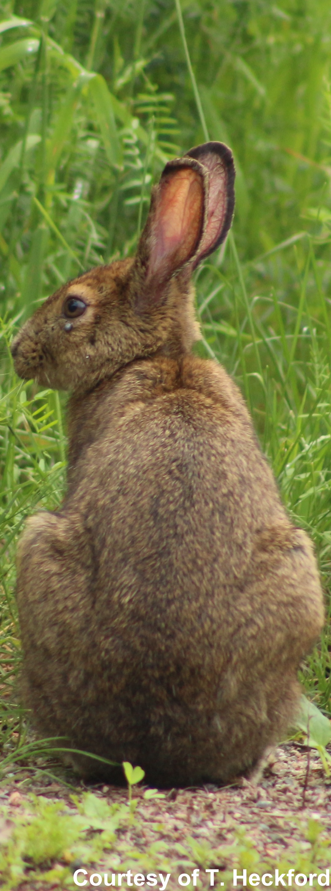

My research mostly takes place at the interface between Wildlife, Landscape, and Ecosystem Ecology. Currently, I am working on three main themes.

<head>
<meta name="viewport" content="width=device-width, initial-scale=1">

</head>

<body>

<!-- <h2>Tabs</h2>

Click on the buttons inside the tabbed menu:
 -->

  <button class="tablinks active" onclick="openTheme(event, 'Individuals')" id="defaultOpen">Ecology of Individuals</button>
  <button class="tablinks" onclick="openTheme(event, 'Ecosystems')">Ecology of Ecosystems</button>
  <button class="tablinks" onclick="openTheme(event, 'Theory')">Theoretical Ecology</button>

Organisms&mdash;plants, animals, and microbes&mdash;are the starting point of my research. Through foraging, interacting with other organisms, or spending time in a given place, organisms shape the environment. Likewise, the characteristics of their environment cause organisms to change how they act. Organism-environment interactions are the backbone upon which most of what we know about the ecology of ecosystems is built. Consequently, investigating and describing these interactions are fundamental steps to understand how ecosystems&mdash;and our planet&mdash;work.
 
 
My interest in organism behaviour has led me to investigate what constrains it&mdash;from biochemistry to the laws of physics. I am also interested in how we as researchers and scientists describe and study the interactions among organisms and their environment.

<h3>Relevant papers</h3>
<ul>
  <li>Rizzuto M, Leroux SJ, Vander Wal E, et al. (2021) Forage stoichiometry predicts the home range size of a small terrestrial herbivore. Oecologia 197:327–338. DOI: <a href="https://doi.org/10.1007/s00442-021-04965-0">10.1007/s00442-021-04965-0</a></li>
  <li>Ellis‐Soto D, Ferraro KM, Rizzuto M, et al. (2021) A methodological roadmap to quantify animal‐vectored spatial ecosystem subsidies. Journal of Animal Ecology 90:1605–1622. DOI: <a href="https://doi.org/10.1111/1365-2656.13538">10.1111/1365-2656.13538</a></li>
  <li>Rizzuto M, Leroux SJ, Vander Wal E, et al. (2019) Patterns and potential drivers of intraspecific variability in the body C, N, and P composition of a terrestrial consumer, the snowshoe hare (<i>Lepus americanus</i>). Ecology and Evolution 9:14453–14464. DOI: <a href="https://doi.org/10.1002/ece3.5880">10.1002/ece3.5880</a></li>
  <li>Rizzuto M, Carbone C, Pawar S (2018) Foraging constraints reverse the scaling of activity time in carnivores. Nature Ecology & Evolution 2:247–253. DOI: <a href="https://doi.org/10.1038/s41559-017-0386-1">10.1038/s41559-017-0386-1</a></li>
</ul>

Ecosystems are one of the basic units of ecology: combinations of organisms and inorganic environmental features that interact at multiple spatial and temporal scales. A forest on the side of a mountain, a tree in that forest, or a leaf on that tree are all examples of ecosystems. Despite their obvious differences in size, each comprises <i>trophic interactions</i> and <i>exchanges of materials</i> with their surroundings. In a <i>trophic interaction</i> a consumer&mdash;e.g., a plant, an animal, a bacteria&mdash;consumes a resource, for instance, nutrients in the soil or another organism, to obtain energy, grow, and eventually reproduce. <i>Exchanges of materials</i> with the ecosystem’s surroundings comprise mobilising and transporting matter, energy, and information in time and space. Trophic interactions within ecosystems and cross-ecosystem exchanges weave a network that spans the globe, supporting life everywhere.

My work focuses on investigating and understanding how cross-ecosystem exchanges modify the dynamics of ecosystems over time. I am also interested in how ecosystem characteristics—for instance, resource distribution in space and time—change the way organisms use their environment.

<figure>

<figcaption>A conceptual roadmap to study animal's contributions to ecosystem nutrient cycles. From <a href="https://doi.org/10.1111/1365-2656.13538">Ellis-Soto, Ferraro, et al. (2021) J. Anim. Ecol. 90(7):1605-1622.</a> &copy; 2021 The Authors, British Ecological Society.</figcaption>
</figure>

<h3>Relevant papers</h3>
<ul>
  <li>Rizzuto M, Leroux SJ, Vander Wal E, et al. (2021) Forage stoichiometry predicts the home range size of a small terrestrial herbivore. Oecologia 197:327–338. DOI: <a href="https://doi.org/10.1007/s00442-021-04965-0">10.1007/s00442-021-04965-0</a></li>
  <li>Heckford TR, Leroux SJ, Vander Wal E, et al. (2021) Spatially explicit correlates of plant functional traits inform landscape patterns of resource quality. Landscape Ecology. DOI: <a href="https://doi.org/10.1007/s10980-021-01334-3">10.1007/s10980-021-01334-3</a></li>
  <li>Ellis‐Soto D, Ferraro KM, Rizzuto M, et al. (2021) A methodological roadmap to quantify animal‐vectored spatial ecosystem subsidies. Journal of Animal Ecology 90:1605–1622. DOI: <a href="https://doi.org/10.1111/1365-2656.13538">10.1111/1365-2656.13538</a></li>
  <li>Richmond IC, Balluffi-Fry J, Vander Wal E, et al. (2021) Individual snowshoe hares manage risk differently: integrating stoichiometric distribution models and foraging ecology. Journal of Mammalogy, gyab130. DOI: <a href="https://doi.org/10.1093/jmammal/gyab130">10.1093/jmammal/gyab130</a></li>
  <li>Balluffi-Fry J, Leroux SJ, Wiersma YF, et al. (2021) Integrating plant stoichiometry and feeding experiments: state-dependent forage choice and its implications on body mass. Oecologia. DOI: <a href="https://doi.org/10.1007/s00442-021-05069-5">10.1007/s00442-021-05069-5</a></li>
  <li>Balluffi‐Fry J, Leroux SJ, Wiersma YF, et al. (2020) Quantity–quality trade‐offs revealed using a multiscale test of herbivore resource selection on elemental landscapes. Ecology and Evolution 10:13847–13859. DOI: <a href="https://doi.org/10.1002/ece3.6975">10.1002/ece3.6975</a></li>
</ul>

Empirical, boots-on-the-ground research is where my passion for ecology was born. However, between one fieldwork bout and the next, I developed an interest in ecological theory and its multiple facets. Theoretical work in ecology is helpful as working on a piece of paper or a computer screen provides something very hard to come by in the field: repeatability and control. I find toy experiments and simple mathematical models beneficial for learning about a new system, developing research ideas, and shaping research questions and hypotheses. One can then take these and test them in the lab or the field, come back to the theory to adjust what did not work, and repeat the process all over again. Working on both sides of the theoretical-empirical spectrum can be very challenging, but also very rewarding.

My forays into theoretical ecology are just beginning. I am interested in how animal activities&mdash;particularly, movement&mdash;are featured in mathematical models of ecosystem functioning. I am also collaborating with several stellar researchers to develop new perspectives on how contaminants affect ecosystems by combining mathematical models of ecosystem and contaminants dynamics. Finally, I am working to include exchanges of information among organisms and between organisms and their environment (e.g., alarm calls, pheromones, light-dark cycles) as an additional currency in ecological models, to tackle some of the more elusive questions in ecology.

<figure>

<figcaption>A diagram showing the effects of information on ecosystem processes. From <a href="https://doi.org/10.32942/osf.io/hc83u">Little, Rizzuto, et al. (2020).</a></figcaption></figure>

<h3>Relevant papers</h3>
<ul>
  <li>Ellis‐Soto D, Ferraro KM, Rizzuto M, et al. (2021) A methodological roadmap to quantify animal‐vectored spatial ecosystem subsidies. Journal of Animal Ecology 90:1605–1622. DOI: <a href="https://doi.org/10.1111/1365-2656.13538">10.1111/1365-2656.13538</a></li>
  <li>Little CJ, Rizzuto M, Luhring TM, et al. Movement with Meaning: Integrating Information into Meta-Ecology. Accepted, Oikos. DOI: <a href="https://doi.org/10.32942/osf.io/hc83u">10.32942/osf.io/hc83u</a></li>
</ul>

</body>

<!-- <h2><b>Ecology of Individuals</b></h2>

Organisms&mdash;plants, animals, and microbes&mdash;are the starting point of my research. Through foraging, interacting with other organisms, or spending time in a given place, organisms shape the environment. At the same time, the characteristics of their environment cause organisms to change how they act. Organism-environment interactions are the backbone upon which most of what we know about the ecology of ecosystems is built. Consequently, investigating and describing these interactions are fundamental steps towards developing a holistic, general understanding of the way ecosystems&mdash;and our planet&mdash;work.

My interest in organism behaviour has led me to investigate what constrains it&mdash;from animal biochemistry to the laws of physics. I also study how environmental characteristics&mdash;for instance, food biochemistry&mdash;influence how organisms use their space and explore how we as researchers and scientists describe and study the interactions among organisms and their environment.

<h3>Relevant papers</h3>
<ul>
  <li>Rizzuto M, Leroux SJ, Vander Wal E, et al. (2021) Forage stoichiometry predicts the home range size of a small terrestrial herbivore. Oecologia 197:327–338. DOI: <a href="https://doi.org/10.1007/s00442-021-04965-0">10.1007/s00442-021-04965-0</a></li>
  <li>Heckford TR, Leroux SJ, Vander Wal E, et al. (2021) Spatially explicit correlates of plant functional traits inform landscape patterns of resource quality. Landscape Ecology. DOI: <a href="https://doi.org/10.1007/s10980-021-01334-3">10.1007/s10980-021-01334-3</a></li>
  <li>Ellis‐Soto D, Ferraro KM, Rizzuto M, et al. (2021) A methodological roadmap to quantify animal‐vectored spatial ecosystem subsidies. Journal of Animal Ecology 90:1605–1622. DOI: <a href="https://doi.org/10.1111/1365-2656.13538">10.1111/1365-2656.13538</a></li>
  <li>Rizzuto M, Leroux SJ, Vander Wal E, et al. (2019) Patterns and potential drivers of intraspecific variability in the body C, N, and P composition of a terrestrial consumer, the snowshoe hare (<i>Lepus americanus</i>). Ecology and Evolution 9:14453–14464. DOI: <a href="https://doi.org/10.1002/ece3.5880">10.1002/ece3.5880</a></li>
  <li>Rizzuto M, Carbone C, Pawar S (2018) Foraging constraints reverse the scaling of activity time in carnivores. Nature Ecology & Evolution 2:247–253. DOI: <a href="https://doi.org/10.1038/s41559-017-0386-1">10.1038/s41559-017-0386-1</a></li>
</ul>

<h2>Ecology of Ecosystems</h2>

Ecosystems are one of the basic units of ecology: combinations of organisms and inorganic environmental features that interact at multiple spatial and temporal scales. A forest on the side of a mountain, a tree in that forest, or a leaf on that tree are all examples of ecosystems. Despite their obvious differences in size, each comprises <i>trophic interactions</i> and <i>exchanges of materials</i> with their surroundings. In a <i>trophic interaction</i> a consumer&mdash;e.g., a plant, an animal, a bacteria&mdash;consumes a resource, for instance, nutrients in the soil or another organism, to obtain energy, grow, and eventually reproduce. <i>Exchanges of materials</i> with the ecosystem’s surroundings comprise mobilising and transporting matter, energy, and information in time and space. Trophic interactions within ecosystems and cross-ecosystem exchanges weave a network that spans the globe, supporting life everywhere.

My work focuses on investigating and understanding how cross-ecosystem exchanges modify the dynamics of ecosystems over time. I am also interested in how ecosystem characteristics change how organisms use their environment, and how environmental characteristics shape a species’ activities and trade-offs.

<h5>Relevant papers</h5>

<ul>
  <li>Rizzuto M, Leroux SJ, Vander Wal E, et al. (2021) Forage stoichiometry predicts the home range size of a small terrestrial herbivore. Oecologia 197:327–338. DOI: <a href="https://doi.org/10.1007/s00442-021-04965-0">10.1007/s00442-021-04965-0</a></li>
  <li>Ellis‐Soto D, Ferraro KM, Rizzuto M, et al. (2021) A methodological roadmap to quantify animal‐vectored spatial ecosystem subsidies. Journal of Animal Ecology 90:1605–1622. DOI: <a href="https://doi.org/10.1111/1365-2656.13538">10.1111/1365-2656.13538</a></li>
  <li>Richmond IC, Balluffi-Fry J, Vander Wal E, et al. (2021) Individual snowshoe hares manage risk differently: integrating stoichiometric distribution models and foraging ecology. Journal of Mammalogy, gyab130. DOI: <a href="https://doi.org/10.1093/jmammal/gyab130">10.1093/jmammal/gyab130</a></li>
  <li>Balluffi-Fry J, Leroux SJ, Wiersma YF, et al. (2021) Integrating plant stoichiometry and feeding experiments: state-dependent forage choice and its implications on body mass. Oecologia. DOI: <a href="https://doi.org/10.1007/s00442-021-05069-5">10.1007/s00442-021-05069-5</a></li>
  <li>Balluffi‐Fry J, Leroux SJ, Wiersma YF, et al. (2020) Quantity–quality trade‐offs revealed using a multiscale test of herbivore resource selection on elemental landscapes. Ecology and Evolution 10:13847–13859. DOI: <a href="https://doi.org/10.1002/ece3.6975">10.1002/ece3.6975</a></li>
</ul>

<h2>Ecological Theory</h2>

Empirical, boots-on-the-ground research, like the studies described above, is where my passion for ecology was born. However, between one fieldwork bout and the next, I developed an interest in ecological theory and its multiple facets. Theoretical work in ecology is helpful as working on a piece of paper or a computer screen provides something very hard to come by in the field: repeatability and control. I find toy experiments and simple mathematical models beneficial for learning about a new system, developing research ideas, and shaping research questions and hypotheses. One can then take these and test them in the lab or the field, come back to the theory to adjust what did not work, and repeat the process all over again. Working on both sides of the theoretical-empirical spectrum can be very challenging, but also very rewarding.

My forays into theoretical ecology are just beginning. I am interested in how animal activities&mdash;particularly, movement&mdash;are featured in mathematical models of ecosystem functioning. I am also collaborating with several stellar researchers to develop new perspectives on how contaminants affect ecosystems by combining ecosystem and contaminants mathematical models. Finally, I am working to include exchanges of information among organisms and between organisms and their environment (e.g., alarm calls, pheromones, light-dark cycles) as an additional currency in ecological models, to tackle some of the more elusive questions in ecology.

<h5>Relevant papers</h5>

<ul>
  <li>Ellis‐Soto D, Ferraro KM, Rizzuto M, et al. (2021) A methodological roadmap to quantify animal‐vectored spatial ecosystem subsidies. Journal of Animal Ecology 90:1605–1622. DOI: <a href="https://doi.org/10.1111/1365-2656.13538">10.1111/1365-2656.13538</a></li>
  <li>Little CJ, Rizzuto M, Luhring TM, et al. (2020) Filling the Information Gap in Meta-Ecosystem Ecology. EcoEvoRxiv preprint. DOI: <a href="https://doi.org/10.32942/osf.io/hc83u">10.32942/osf.io/hc83u</a></li>
</ul> -->
