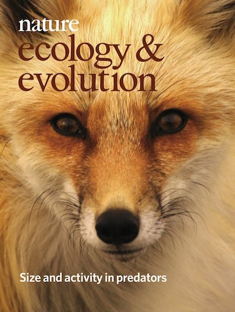

My first research project for my Master of Research degree involved a computer-based meta-analysis of the literature on activity patterns of carnivores. Working at Imperial College Silwood Park Campus, I investigated whether the amount of time carnivores spend active during a 24-hour period scales with body weight. I assembled a novel, comprehensive database of activity data for species spanning in size from the Least Weasel (_Mustela nivalis_) to Tigers (_Panthera tigris_), digitizing tables and graphs from published sources. My analyses focused strictly on radio-tracking data, as these are the best-quality data on animal activity available at present. In addition to analyzing these empirical data, I also developed a simple mathematical model - based on physiological first principles - that will allow researchers and wildlife managers to predict how much time a given species spends active during the day. This, in turn, will hopefully inform both future studies design and conservation policy.

## Relevant publications
**Rizzuto, M.**<a title='Corresponding author'>✉</a>, Carbone, C. and Pawar, S. (2018). [*Foraging constraints reverse the scaling of activity time in carnivores*](https://www.nature.com/articles/s41559-017-0386-1). Nature Ecology and Evolution, 2 (2), 247–253.
