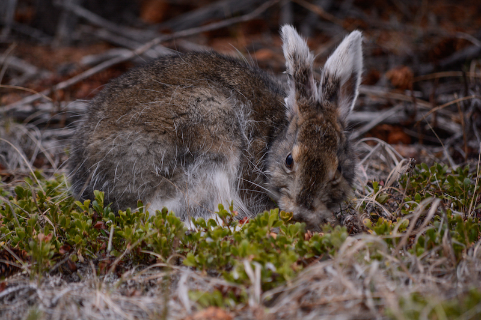

All life is made up of about 25 chemical elements, arranged in differentproportion among different organisms. The first chapter of my PhD thesis investigated what drivers the elemental composition of a terrestrial vertebrate, the snowshoe hare. With my coauthors, we collected data on elemental composition of these herbivores. We observed a lot of variability in the concentrations of carbon, nitrogen, and phosphorus in our study animals. However, when we used regression models to investigate this variability, we only found weak evidence that the set of variables we were testing had an influence on the variation in carbon, nitrogen, and phosphorus composition of our snowshoe hares. Our work was among the first to attempt this sort of analyses for a terrestrial vertebrate, and highlighted how much more variable these organisms can be in terms of their content of key chemical elements.
Photo credit: [Juliana Balluffi-Fry](https://twitter.com/balluffi)

## Relevant Publications
<a href="https://onlinelibrary.wiley.com/doi/full/10.1002/ece3.5880">Patterns and potential drivers of intraspecific variability in the body C, N, and P composition of a terrestrial consumer, the snowshoe hare (<i>Lepus americanus</i>)</a>
