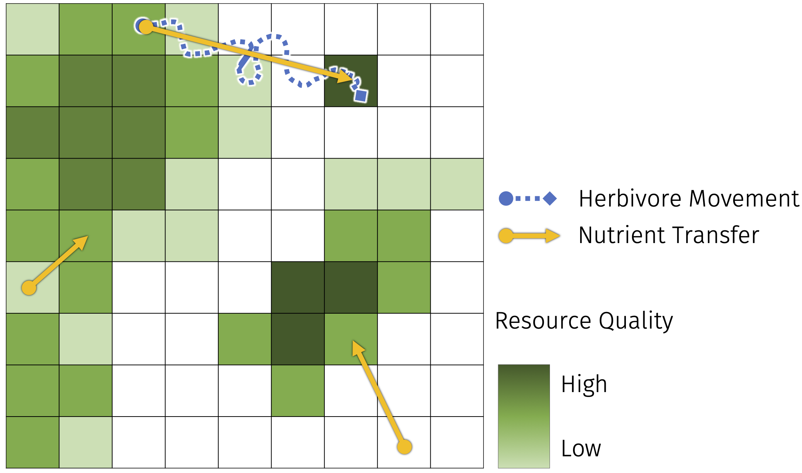

Consumer, herbivores and carnivores, constantly move across different ecosystems in their search for food. Whether it is plants or other animals, this food is patchily distributed over the landscape and different patches vary in their quality --- that is, its content of key nutrients like nitrogen and phosphorus. Optimal Foraging Theory postulates that consumers will always look for the more 'bang for buck' when it comes to food: the best quality at the lowest cost. Thus, foraging movements consumers make to find and forage on high quality food may establish links between areas of varying quality. For the third chapter of my Ph.D thesis, I am developing a mathematical model that tracks the movements of consumers among areas of high and low food quality, and the assesses their effects in terms of increased resource depletion, nutrient input in ecosystem reservoirs, and nutrient cycling in meta-ecosystems. My goal is to contribute painting a clearer picture of the effects of small-scale, frequent nutrient movements mediated by consumers on ecosystem dynamics. In turn, this may help inform conservation practices and policies, like establishment of wildlife corridors.

<h3>Relevant Publications</h3>

Ellis-Soto, D.<a title='Corresponding author'>✉</a>, Ferraro, K. M., **Rizzuto, M.**, Briggs, E., Monk, J. D., and Schmitz, O. J. (2020). [*A methodological roadmap to quantify animal-vectored spatial ecosystem subsidies*](https://doi.org/10.32942/osf.io/zyx84). EcoEvoRxiv. 
